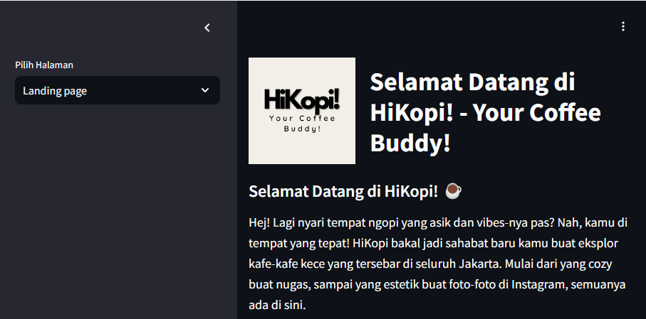
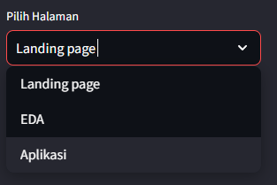
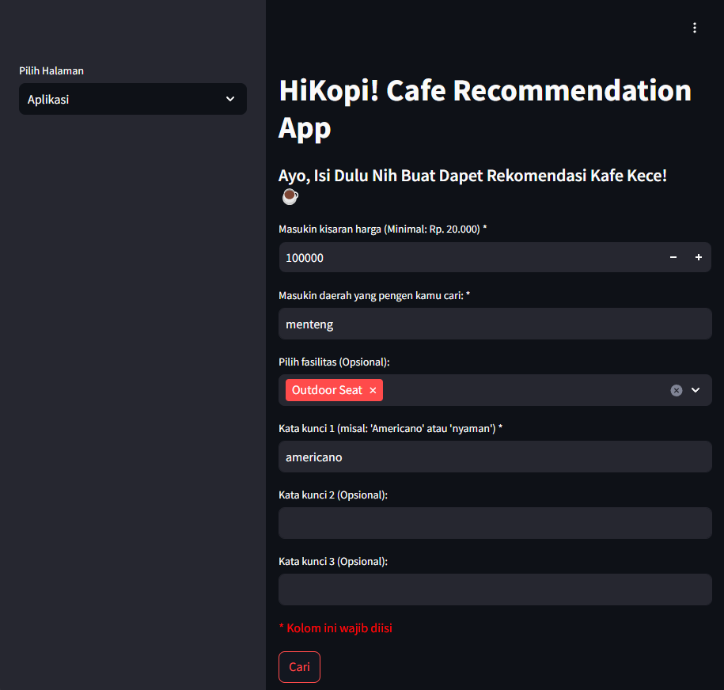
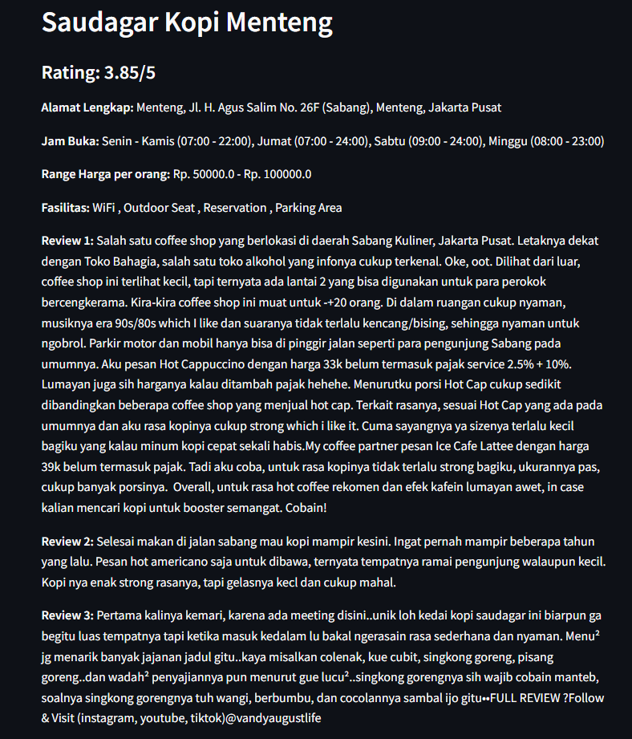

    <h1><b>HiKopi!</b></h1>
    
      
    
Hej! Lagi nyari tempat ngopi yang asik dan vibes-nya pas? Nah, kamu di tempat yang tepat! HiKopi bakal jadi sahabat baru kamu 
            buat eksplor kafe-kafe kece yang tersebar di seluruh Jakarta. Mulai dari yang cozy buat nugas, sampai yang estetik buat foto-foto 
            di Instagram, semuanya ada di sini.

     

--- 
##  **Dataset**
Data kami adalah data hasil scrapping dari website pergikuliner.com yang berisi data-data mengenai cafe yang berada di Jakarta.
[Source.](https://pergikuliner.com/restaurants?utf8=%E2%9C%93&search_place=&default_search=Jakarta&search_name_cuisine=kafe&commit=)

---
##  **Problem Background**

Bisnis kedai kopi di Indonesia berkembang pesat, didorong oleh meningkatnya konsumsi kopi, terutama di kalangan milenial dan Generasi Z. Studi Toffin dan MIX MarComm (2019) mencatat bahwa jumlah kedai kopi waralaba di Indonesia mencapai 2.950, hampir tiga kali lipat dari tahun 2016. Pasar kedai kopi diperkirakan bernilai lebih dari Rp4,8 triliun per tahun. Survei terbaru juga menunjukkan bahwa 63,91% responden lebih memilih kedai kopi dibandingkan kafe roti atau ruang kerja bersama.

Untuk mengikuti perkembangan zaman, maka di butuhkan suatu aplikasi untuk mengakomodir kebutuhan kopi masyarakan Indonesia, khususnya pada kesempatan kali ini adalah Jakarta, karena Jakarta merupakan pusat ekonomi Indonesia.

---
##  **Objective**

Tujuan utama dari pengembangan aplikasi rekomendasi kafe ini adalah untuk mempermudah pengguna dalam menemukan kafe sesuai dengan preferensi mereka berdasarkan harga, lokasi, dan fasilitas secara cepat dan efisien. Aplikasi ini dirancang untuk memberikan rekomendasi yang lebih personal dengan memanfaatkan teknologi Natural Language Processing (NLP), sehingga dapat memahami dan menganalisis ulasan serta kata kunci yang dimasukkan pengguna. Dengan menyediakan informasi lengkap mengenai kafe, termasuk ulasan pengunjung, fasilitas yang tersedia, dan lokasi, aplikasi ini diharapkan dapat meningkatkan pengalaman pengguna dalam memilih kafe yang tepat. Selain itu, aplikasi ini juga bertujuan untuk memperluas cakupan pasar dengan mengumpulkan data dari berbagai kota di Indonesia. Integrasi teknologi Streamlit dan Hugging Face memungkinkan aplikasi ini mudah diakses secara online dan memberikan kenyamanan dalam penggunaannya.

## **Cara Penggunaan Aplikasi**
### 1. Anda dapat mengakses HiKopi! [disini](https://huggingface.co/spaces/aliansyahr/hikopi)

### Ini adalah halam awal yang akan anda temui. 
   

### 2. Untuk mengakses Aplikasi nya anda cukup pilih halam di pada navigation bar dan pilih halaman "Aplikasi" 
   

### 3. Pada Halaman ini, anda harus mengisi form yang bertanda '*' agar aplikasi dapat berfungsi." 
   

### 4. Hasil dari pencarian akan terlihat seperti ini:  
 

### Selamat Nongkrong!!. Have a good time at your best place 

# Contributors
- [Fahri Armand Rasyad](https://www.linkedin.com/in/fahri-armand-rasyad-19987123a/)
- [Maulana Achsan](https://www.linkedin.com/in/asan133/)
- [Harun](https://www.linkedin.com/in/harun-yoel-hutabarat-bb7053321/)
- [Muhammad Aliansyah Ramadhan](https://www.linkedin.com/in/aliansyahr/)
- [Muhammad Ashar Ihsan](https://www.linkedin.com/in/muhammadasharihsan/)
